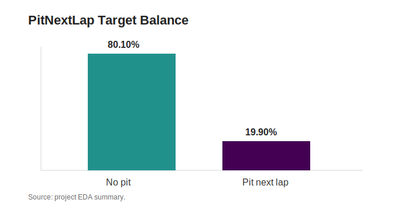
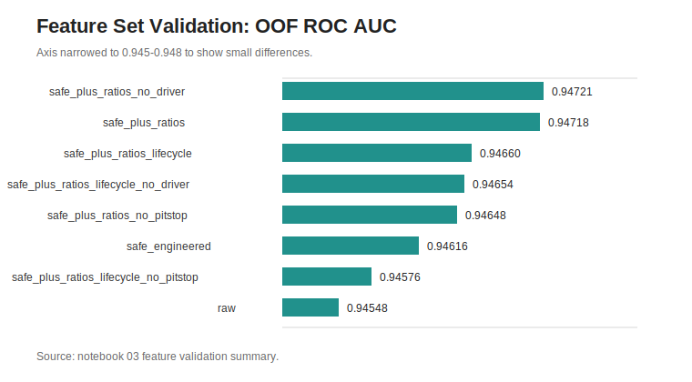

# EDA Insights

## 1. Purpose

[`1_eda_and_circuit_context.ipynb`](../notebooks/1_eda_and_circuit_context.ipynb)
establishes the data profile and modeling hypotheses for predicting
`PitNextLap`. The notebook answers four practical questions:

1. Is the competition data clean enough for direct modeling?
2. Which raw fields explain pit-next-lap behavior?
3. Does train/test drift require a special validation design?
4. Which EDA findings should drive feature engineering and model choice?

## 2. Notebook Flow

| Step | Purpose | Output |
| --- | --- | --- |
| Setup and Configuration | Define constants, plotting defaults, and shared runtime values. | Reproducible notebook configuration. |
| Load Data | Read `train.csv`, `test.csv`, and `sample_submission.csv`. | Memory-reduced train/test frames. |
| Data Quality | Check missingness, duplicated rows, duplicated IDs, and schema shape. | Dataset health tables. |
| Target and Categorical Signal | Measure target balance and categorical pit-rate differences. | Target-rate and category-rate summaries. |
| Numerical Signal and Outliers | Inspect numeric distributions and extreme values. | Numeric summary and outlier context. |
| Strategy Interactions | Study compound, stint, tyre-life, and race-progress interactions. | Heatmaps that motivate engineered features. |
| Train/Test Drift | Compare train and test distributions. | PSI and category coverage diagnostics. |
| Circuit Context and Strategy Maps | Visualize race-progress pit windows. | Race slices and stylized circuit dashboards. |

## 3. Dataset Health

The EDA notebook shows a clean, stable dataset:

| Check | Result |
| --- | ---: |
| Training rows | 439,140 |
| Training columns | 16 |
| Test rows | 188,165 |
| Test columns | 15 |
| Target positive rate | 19.90% |
| Missing values | 0 |
| Duplicated rows | 0 |
| Duplicated IDs | 0 |
| Train/test ID overlap | 0 |

Implication: modeling effort can focus on feature quality and validation rather
than heavy cleaning or imputation strategy.

## 4. Target Behavior

`PitNextLap` is imbalanced but not extremely rare. About one in five training
rows is positive. This supports probability modeling with stratified
cross-validation and makes average precision a useful secondary metric.

Modeling decision:

- Use probability metrics, not hard-label accuracy.
- Keep ROC AUC for ranking, average precision for positive-class retrieval, and
  log loss/calibration diagnostics for probability quality.
- Use stratified folds as the default validation pattern.

## 5. Categorical Signal

`Compound` is one of the strongest raw signals. The README-level EDA summary
records that `HARD` has a much higher pit-next-lap rate than `MEDIUM`, while
`WET` is rare and low-rate.

The rendered EDA output gives the useful scale:

| Compound | Rows | PitNextLap Rate | Difference vs Global |
| --- | ---: | ---: | ---: |
| `HARD` | 170,518 | 0.32754 | +0.12856 |
| `SOFT` | 38,744 | 0.19348 | -0.00551 |
| `INTERMEDIATE` | 17,382 | 0.15228 | -0.04670 |
| `MEDIUM` | 211,141 | 0.10113 | -0.09785 |
| `WET` | 1,355 | 0.02509 | -0.17389 |

Implication: categorical handling must preserve compound identity. Tree models
with ordinal-encoded categoricals work well here because the strongest
interactions are nonlinear and strategy-dependent.

Modeling decision:

- Keep `Compound` as a first-class feature.
- Validate `Driver` carefully because it is high-cardinality: train has `887`
  driver labels and test has `801`, with `86` train-only labels.
- Prefer compact race/compound/stint interactions over broad identity-heavy
  encodings.

## 6. Numerical Signal

Important raw signals include:

- `TyreLife`;
- `Stint`;
- `RaceProgress`;
- `LapNumber`;
- lap-time and degradation features;
- race identity and circuit context.

Lap-time features contain extreme values, especially `LapTime_Delta`,
`LapTime (s)`, and `Cumulative_Degradation`. This favors tree-based models over
purely linear methods.

Important rendered-output ranges:

| Feature | Median | Minimum | Maximum |
| --- | ---: | ---: | ---: |
| `LapTime_Delta` | -0.295 | -2403.895 | 2423.932 |
| `LapTime (s)` | 90.521 | 67.694 | 2507.607 |
| `Cumulative_Degradation` | -20.994 | -274.564 | 2412.026 |
| `TyreLife` | 12.000 | 1.000 | 77.000 |
| `RaceProgress` | 0.269 | 0.013 | 1.000 |

Implication: do not clip or transform these fields casually. Validate any
outlier treatment against tree-model OOF metrics because extreme timing values
may encode meaningful race-state events.

Modeling decision:

- Prefer boosted trees as the primary model family because they handle nonlinear
  thresholds and extreme timing values well.
- Avoid aggressive clipping until a clipped variant beats the baseline in OOF
  validation.
- Create safe timing features such as `AbsLapTime_Delta`,
  `LapTime_plus_Delta`, and degradation-rate style checks only when validated.

## 7. Strategy Interaction Findings

The EDA interaction plots support a simple but important point: pit risk is not
controlled by one raw feature. Tyre age changes meaning depending on compound,
stint, and race progress. A late-race medium-tyre row and an early-race hard-tyre
row can have similar tyre life but very different pit intent.

Modeling decision:

- Add compact row-safe ratios:
  - `TyreLife_to_LapNumber`;
  - `TyreLife_to_EstimatedRaceLaps`;
  - estimated laps remaining;
  - lap number by race progress.
- Validate lifecycle reconstructions separately because broad tyre-age feature
  expansion can add noise.
- Use model families that can learn interactions without manual cross-products
  for every categorical combination.

## 8. Train/Test Drift

Numeric train/test drift is very low. The largest PSI values are still tiny,
led by `TyreLife`, `RaceProgress`, and `LapNumber`.

Top PSI values from the rendered EDA output:

| Feature | Train Mean | Test Mean | PSI |
| --- | ---: | ---: | ---: |
| `TyreLife` | 14.15823 | 14.16063 | 0.000186 |
| `RaceProgress` | 0.33766 | 0.33670 | 0.000177 |
| `LapNumber` | 23.10591 | 23.05019 | 0.000164 |
| `LapTime (s)` | 90.94875 | 90.98687 | 0.000105 |
| `Cumulative_Degradation` | -25.72176 | -25.84949 | 0.000096 |

Implication: the public test distribution appears close enough to train that
standard stratified CV is a useful first validation strategy. The remaining risk
is less about global drift and more about race-specific calibration.

Modeling decision:

- Standard stratified CV is a reasonable default.
- Do not overfit the validation design around distribution shift that is not
  visible in the data.
- Spend more effort on race-level error analysis than on train/test drift
  correction.

## 9. Feature Engineering Implications

The best-performing engineered set is `safe_plus_ratios_no_driver`.

| Feature Set | Features | OOF ROC AUC | OOF Average Precision | OOF Log Loss |
| --- | ---: | ---: | ---: | ---: |
| `safe_plus_ratios_no_driver` | 27 | 0.94721 | 0.80489 | 0.22949 |
| `safe_plus_ratios` | 28 | 0.94718 | 0.80499 | 0.22959 |
| `safe_plus_ratios_lifecycle` | 56 | 0.94660 | 0.80225 | 0.23077 |
| `safe_plus_ratios_lifecycle_no_driver` | 55 | 0.94654 | 0.80233 | 0.23082 |
| `safe_plus_ratios_no_pitstop` | 27 | 0.94648 | 0.80265 | 0.23101 |
| `safe_engineered` | 26 | 0.94616 | 0.80277 | 0.23195 |
| `safe_plus_ratios_lifecycle_no_pitstop` | 55 | 0.94576 | 0.79961 | 0.23239 |
| `raw` | 15 | 0.94548 | 0.79997 | 0.23344 |

The broad lifecycle reconstruction did not improve this LightGBM setup. It
added many redundant or noisy features. The simpler ratio-based set is stronger.

Modeling decision:

- Keep `safe_plus_ratios_no_driver` as the champion feature set.
- Treat lifecycle features as a small targeted experiment, not the default
  feature expansion path.
- If adding lifecycle features, test only the highest-intuition subset first:
  `TyreLife_Normalized`, `Laps_Until_Due`, and `Overdue`.

## 10. Calibration and Error Pattern

The tuned LightGBM model is generally well calibrated, but underpredicts some
higher-risk regions:

| Slice | Predicted Rate | Actual Rate |
| --- | ---: | ---: |
| Highest prediction decile | 0.849 | 0.860 |
| Mid-risk band around 0.05-0.20 | 0.115 | 0.122 |

Top-ranked predictions are strong:

| Top Prediction Slice | Precision | Recall |
| --- | ---: | ---: |
| Top 0.5% | 0.96889 | 0.02435 |
| Top 1% | 0.95222 | 0.04785 |
| Top 2% | 0.94083 | 0.09456 |
| Top 5% | 0.90756 | 0.22805 |
| Top 10% | 0.85983 | 0.43211 |
| Top 20% | 0.73942 | 0.74320 |

The largest remaining gaps are race-specific, including Chinese, Belgian,
Japanese, Hungarian, Monaco, Saudi Arabian, and Las Vegas Grand Prix slices.

Notebook 3 confirms that model-family switching is not the main remaining
issue. XGBoost does not improve the tuned LightGBM blend, and notebook 4 shows
that CatBoost is highly correlated with LightGBM (`0.98112`). This points the
next iteration toward race-specific calibration and interaction features rather
than adding more generic model families.

Modeling decision:

- Keep tuned LightGBM as the primary model.
- Use XGBoost and CatBoost as challengers/diversity checks, not default blend
  members.
- Prioritize calibration and race-specific diagnostics over adding more generic
  model families.

## 11. Circuit-Style Deep Dive

The EDA notebook now includes stylized circuit avatars for race-progress
analysis. These are deterministic visual maps generated from race names, not
real circuit geometry. They are still useful because the competition data
contains `RaceProgress` but does not contain GPS track coordinates.

The circuit maps support three diagnostics:

- pit-risk windows by race, using empirical `PitNextLap` rate across
  race-progress bins;
- median tyre life around the selected race-progress path;
- compound-specific pit-rate curves for a selected race.

Implication: the model should not only learn global tyre-life behavior. It
should also be checked for race-specific timing windows, especially when
calibration gaps appear in race slices.

Rendered race-level output shows why this matters:

| Year | Race | Rows | PitNextLap Rate | Median TyreLife |
| ---: | --- | ---: | ---: | ---: |
| 2024 | Monaco Grand Prix | 6,002 | 0.76025 | 25.0 |
| 2025 | Belgian Grand Prix | 1,552 | 0.55348 | 11.0 |
| 2022 | British Grand Prix | 2,532 | 0.50158 | 11.0 |
| 2024 | Spanish Grand Prix | 6,040 | 0.50116 | 12.0 |
| 2024 | Japanese Grand Prix | 2,800 | 0.49286 | 12.0 |

These rates are far above the global `19.90%` target rate. They should be used
as diagnostic slices for calibration, not as a reason to add target-derived
race encodings without fold-safe validation.

Modeling decision:

- Add race-progress bands for diagnostics and possible interaction experiments.
- Evaluate race-specific calibration gaps after every champion-model change.
- Consider fold-safe race calibration only if it improves OOF log loss and does
  not damage top-slice precision.

## 12. Modeling Approach Defined by EDA

The EDA leads to this modeling plan:

| EDA Finding | Modeling Choice | Validation Check |
| --- | --- | --- |
| Clean train/test schema | Minimal preprocessing and direct modeling | Confirm no missing/duplicate issues after load. |
| `PitNextLap` rate near 20% | Probability modeling with stratified folds | Track ROC AUC, AP, and log loss. |
| Compound and stint are strong | Preserve categorical strategy fields | Compare tree models with/without key categoricals. |
| Timing/degradation extremes are large | Prefer boosted trees over linear-only models | Avoid clipping unless OOF improves. |
| Tyre age depends on race progress | Add compact ratio/progress features | Feature-set validation in notebook 3. |
| Train/test drift is tiny | Use ordinary stratified CV first | Review PSI and category coverage. |
| Race slices have large calibration gaps | Diagnose by race and race-progress band | Calibration tables and slice diagnostics. |
| Model challengers are highly correlated | Avoid unnecessary model stacking | Blend search must beat pure LightGBM. |

Current recommended approach:

1. Use tuned LightGBM as the primary model family.
2. Use `safe_plus_ratios_no_driver` as the champion feature set.
3. Keep XGBoost and CatBoost as challengers, not default ensemble members.
4. Explore a small LightGBM seed ensemble before adding more model families.
5. Test race-progress or race-level calibration features only with fold-safe
   validation.
6. Avoid broad lifecycle reconstruction unless a small targeted subset improves
   OOF metrics.
